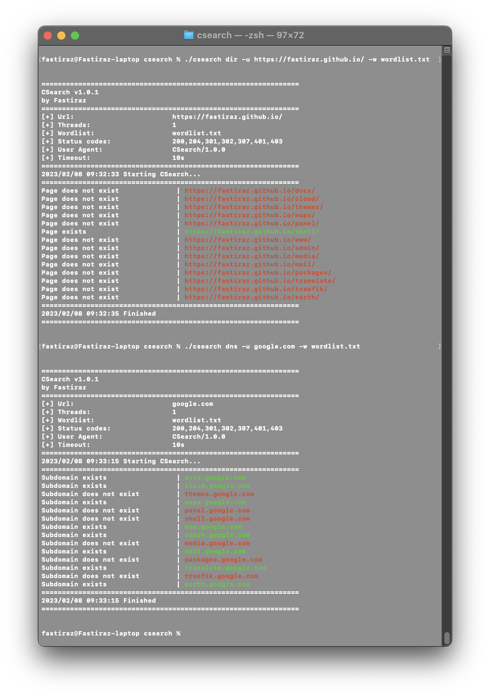

#  L👀K

This C script is a simple tool for brute-forcing URLs and subdomains. It was developed as a way to practice the C programming language and to create a simpler version of [Gobuster](https://github.com/OJ/gobuster).
<br><br>

---

## Usage

Install the `curl` library for Linux and MacOS:

```bash
apt-get install libcurl4-openssl-dev  # 4 Linux
brew install curl                     # 4 OSX
```

To compile the script, use the `gcc` compiler:

```bash
gcc -o csearch csearch.c -lcurl
```

This will create an executable file called csearch that you can run with the ./csearch command.

Note that you may need to install the `gcc` compiler and the `curl` development package (usually called `libcurl-dev` or `libcurl-devel`) on your system in order to compile the script.

To use the script, follow the examples below.

```bash
To brute force an URL :
    ./csearch -u http://example.com/

To brute force subdomains :
    ./csearch dns -u example.com -w /usr/share/wordlists/dirb/common.txt

Fuzzing mode :
    ./csearch fuzz -u https://docs.fuzz.com/ -w /usr/share/wordlists/dirb/common.txt

To use UI :
    ./csearch -ui -u google.com -w lists/test.txt
```

The script will then try each word in the list as a URL extension and report whether the page exists or not.
<br><br>

### DIR Mode


<br><br>

---

## Dependencies

The script requires the [cURL library](https://curl.haxx.se/) to be installed on your system.
<br><br>

---

## HELP

```bash
 ➜ ./csearch -h


===============================================================
	CSearch v1.4
	by Fastiraz
===============================================================

FLAGS:
	-u : URL
	-w : Path to a custom wordlist
	-v : Verbose output (errors)
	-r : Enable recurcive mode
	-h : Display this content
	-ui: Enable the user interface

KEYWORDS:
	dir : Directory mode (default)
	dns : Subdomain mode
	fuzz : Uses fuzzing mode. Replaces the keyword FUZZ in the URL, Headers and the request body

EXAMPLES:
	Usage :	./csearch -u http://example.com/
	Usage :	./csearch dns -u http://example.com/ -w /usr/share/wordlist/dirb/big.txt -v
  Usage : ./csearch fuzz -u https://docs.fuzz.com/ -w /usr/share/wordlists/dirb/common.txt
```
