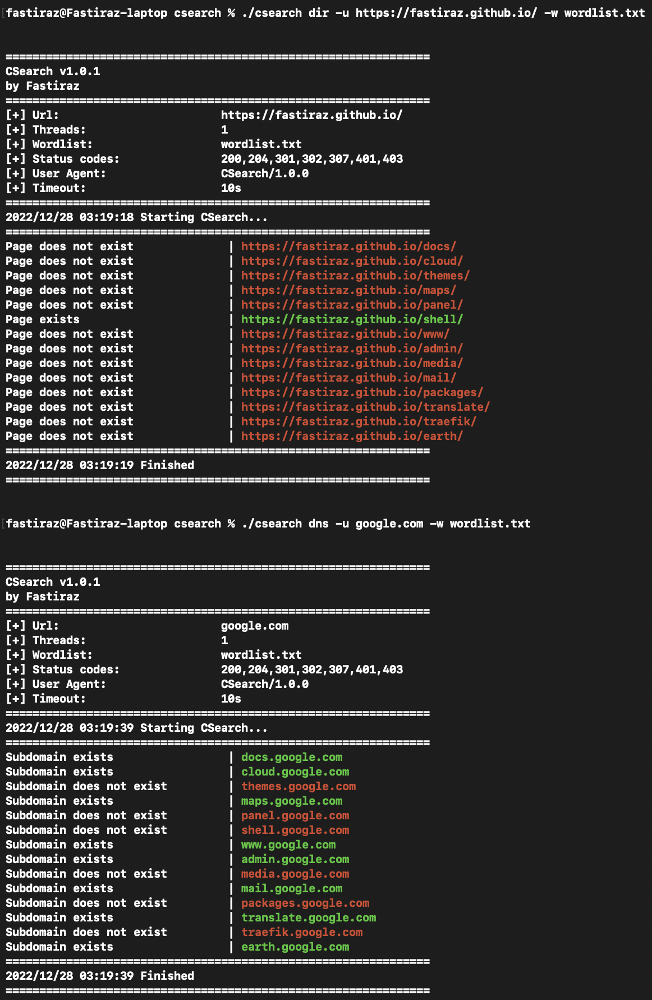

# CSearch

This C script is a simple tool for brute-forcing URLs and subdomains. It was developed as a way to practice the C programming language and to create a simpler version of [Gobuster](https://github.com/OJ/gobuster).
<br><br>

---

## Usage

To compile the script, use the `gcc` compiler:

```bash
gcc -o csearch csearch.c -lcurl
```

This will create an executable file called cbrute that you can run with the ./cbrute command.

Note that you may need to install the `gcc` compiler and the `curl` development package (usually called `libcurl-dev` or `libcurl-devel`) on your system in order to compile the script.

To use the script, follow the examples below.

```bash
To brute force an URL :
    ./csearch dir -u http://example.com -w /usr/share/wordlists/dirb/common.txt

To brute force subdomains :
    ./csearch dns -u example.com -w /usr/share/wordlists/dirb/common.txt
```

The script will then try each word in the list as a URL extension and report whether the page exists or not.
<br><br>



<br><br>

---

## Dependencies

The script requires the [cURL library](https://curl.haxx.se/) to be installed on your system.
<br><br>

---

## Credits

Special thanks to [OJ](https://github.com/OJ) and [Christian Mehlmauer](https://github.com/firefart) for creating Gobuster, which served as inspiration for this script.
